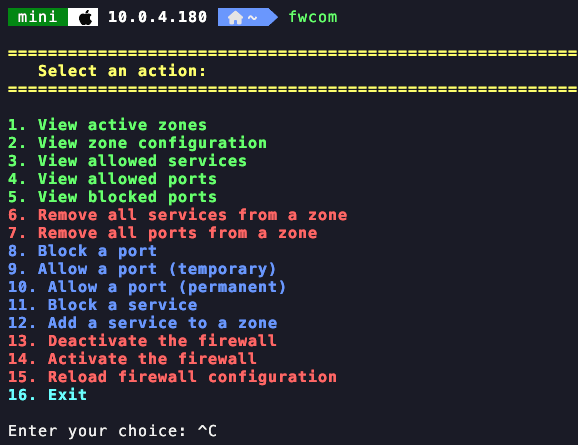
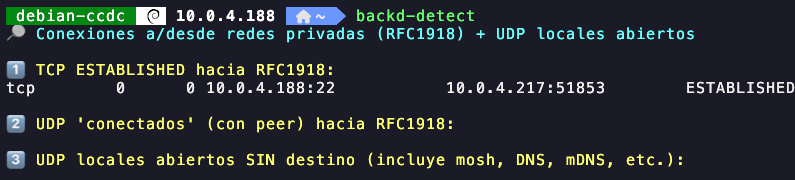
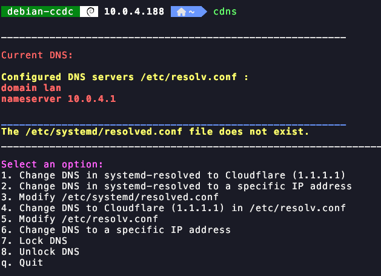
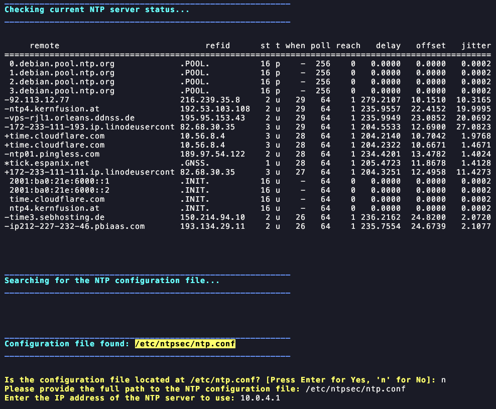
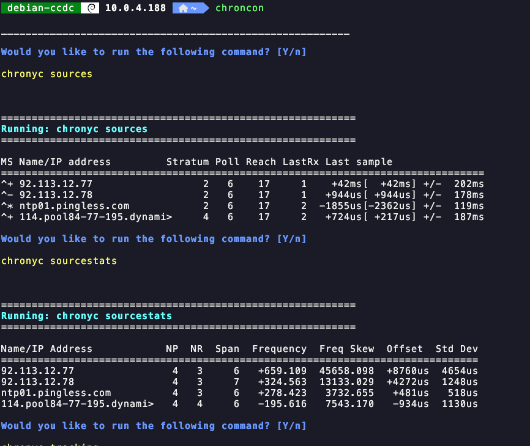
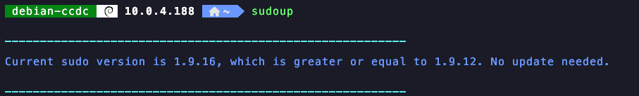
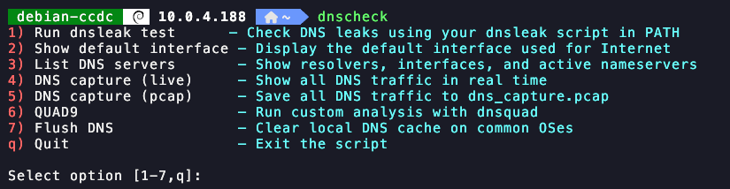
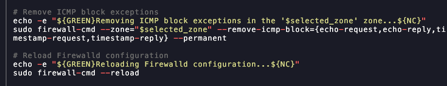
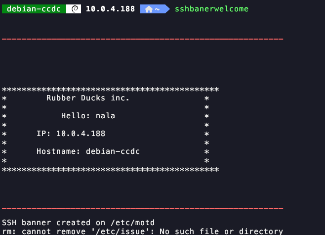
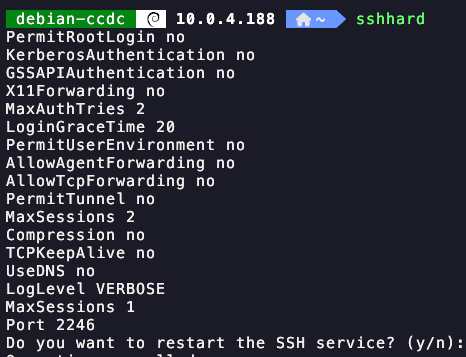

### CCDC Toolkit

**fwcom**  
Firewall-cmd helper commands for managing the firewall.

**backd-detect**  
Uses Python to search for backdoors and active connections.

**cdns**  
Modifies DNS settings as needed.

**ntpcon**  
Connects and enables the NTP time service.

**chroncon**  
Connects and enables the Chrony time service.

**sudoup**  
Updates sudo from version 9.12 onward.

**dnscheck**  
Provides a menu to inspect DNS, routes, options, and capture traffic.

**blockicmp**  
Blocks ICMP through firewall-cmd.

**sshbanerlogin**  
Displays an SSH welcome message before a user logs in.

**sshbanerwelcome**  
Displays an SSH welcome message after a user logs in.

**sshhard**  
Applies SSH hardening configuration.

